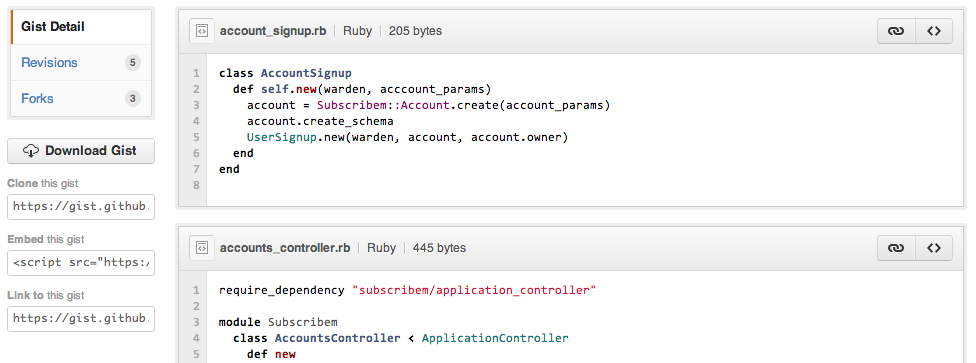
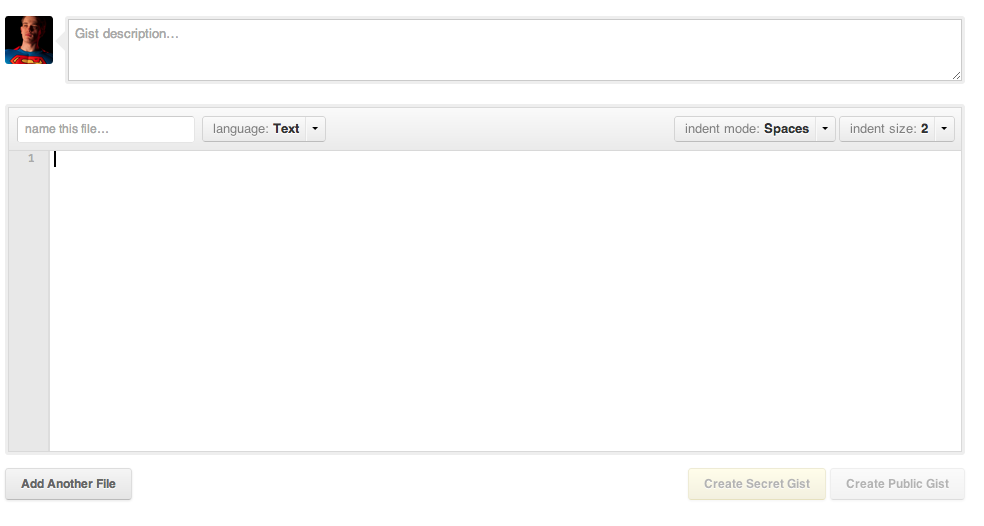
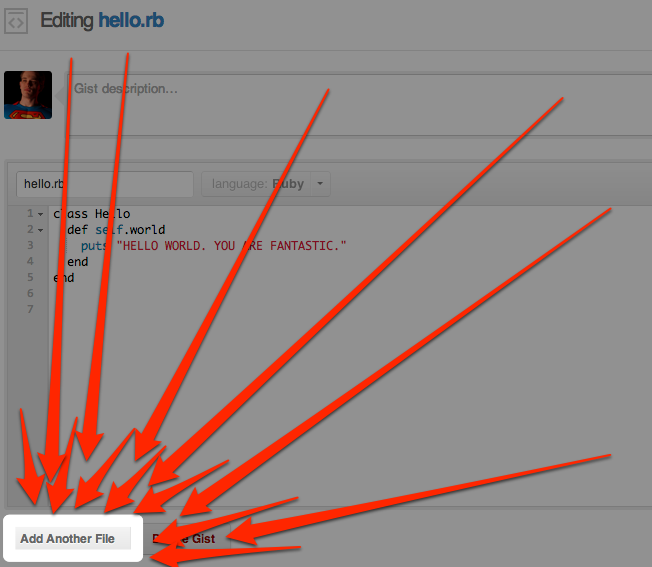
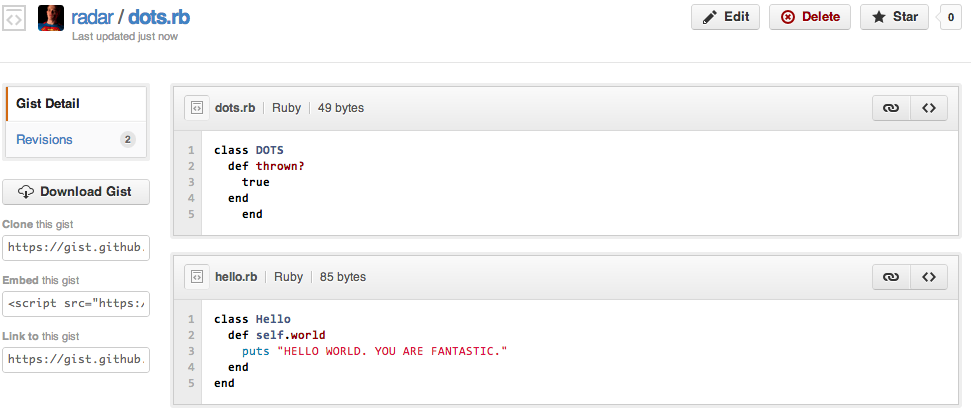

# Using Gist

Gist is a pastebin-like service except that it doesn't suck like [the](http://pastebin.org) [others](http://paste.pocoo.org/). Elaborating on the "it doesn't suck" part: Gist is built on top of the wonderful Git version control system and when you create a new Gist it creates a new Git repository just for your Gist. When the Gist is edited, a new commit is created and Gist provides a little navigation menu on the right hand-side of a page which lets people view the different versions of your Gist, with the most recent shown by default. The dots next to each version represent the number of lines added (green) and the number of lines taken away (red), with a maximum of 7 dots showing. 

Because the Gists are git repositories, we have the ability to clone them just like normal Git repositories using either the public or private URL. If we use the public URL to clone this repository, then the Gist is read-only. If we use the private URL then we're able to push to the Gist from our local machines. Pretty nifty.

This guide was written because many people have difficulty using the [Gist](http://gist.github.com) service correctly, creating [Gists](https://gist.github.com/1171c4e2954b93ae01ab) like this, which leads to barely comprehensible formatting. Which part is the error? Which part is the test? Which part is the code that the test is testing? Who knows?

By the time you're done with reading this guide, you will be a Gist Guru. You will separate out the different parts of your gists, changing them from [drab](https://gist.github.com/1171c4e2954b93ae01ab) to [fab](https://gist.github.com/deb6b32d4a1144377125)!

## A single file Gist

To begin this guide, we're going to start off with the very basic method of creating a Gist with a single file. People with IQs ranging from garden vegetables to veritable genius can grasp this simple concept but still this guide would not be complete without this basic concept, and it's worthwhile covering it as there may be some Conservative-types reading it too.

To get started we'll type http://gist.github.com into our browser's URL bar and press enter. BLAMMO. We're now at the place where Gists are born. At this page, we're presented with a screen that mostly contains a Gist box itself:

Right up the top we've got a box that says "name this file..." which is very, very special. We can type anything we like into this and it's a great way to give meaning to the content that we're able to put there. By typing a name there such as "test.rb", Gist will know (by magic!) that this file is a Ruby file! What does this mean? Well, wait and see what happens when we create the content!

The box directly underneath the "name this file..." box is a description for your Gist. This is especially handy for explaining what's going on in the Gist. We'll leave this blank for now.

The *gigantic box* underneath these is for our code. In this box, we place our code and only our code goes in this box. Our code is this:

    class Hello
      def self.world
        puts "HELLO WORLD. YOU ARE FANTASTIC."
      end
    end

Once this is done, we've got two options. We can create either a public Gist or a private Gist. A public Gist shows up the list of [all the Gists ever](https://gist.github.com/gists) whilst a private one does not. Additionally, a private Gist is given a hashed URL, something such as "https://gist.github.com/1171c4e2954b93ae01ab", which isn't easily guessable. The caveat is that anybody who knows this URL can share it with others freely, so we'll be careful who we share our precious(ssss) Gists with.

In this case, we'll create a public Gist, generating a Gist that is ever so pretty.

Because we've named the file "test.rb", Gist knows that this is a Ruby file and highlights it accordingly. If we didn't name this file, we could have used the "Language" drop-down on the new Gist page to get the same effect. Naming files is so much cooler though.

There we have it, our first ever, well done Gist. Now, what do we do if we want to add another file?

## Throw more files

Now that we've got our very own Gist, we can do with it as we please, such as editing it. Let's press the "edit" button to be taken to a screen similar to the "new gist" screen.

On this screen, we've got a couple of things we can do. We can change the name of the file which could mean that the syntax highlighting changes for our Gist, but only if we change the extension to something different. We could change the content of the Gist which would generate a new revision. Or we could add another file.

Let's add a new file. This seems to be the concept that people have the most difficulty with, so hopefully this informative diagram clearly points out where the "Add another file..." link is.

By pressing this link, we're given another Gist box! Two for the price of one! PHWOAR. In this new Gist box we can enter a completely different filename and different content. Content, like this:

    class DOTS
      def thrown?
        true
      end
    end

This time, let's select "Ruby" from the "Language" select box and see what happens when we press "Save Gist".

ZOMG. Two Ruby files! In one Gist! Amazing!

What else can this amazing service do?

## Embedding

Gists can be embedded into a page using two ways: JavaScript or an `iframe`.

### Javascript embedding

By clicking the "Show embed" link on a Gist we can get a JavaScript snippet which we can place on a page which will show all the files in the Gist. Alternatively, we can click the "embed" link on a single file just to get the embed snippet for a single Gist.

These snippets are simple `script` tags:

    

### iframe embedding

Alternatively, Gist offers a JavaScript-free way of embedding. If we chuck (throw?) a `.pibb` extension on the end of the Gist we'll see a page like this:

We can embed this into a page using an `iframe` tag:

    <iframe src="https://gist.github.com/772646.pibb">

## Conclusion

Gist is a super-powerful-and-awesome service. Use it, and use it properly.

